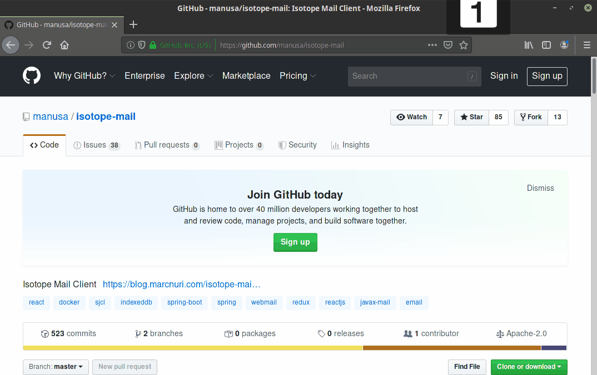

# 
 [](https://github.com/manusa/isotope-mail/blob/master/LICENSE) [](https://travis-ci.org/manusa/isotope-mail) [](https://sonarcloud.io/component_measures?id=manusa_isotope-mail&metric=coverage)

Microservice based webmail client built with ReactJS and Spring.

## Introduction

This webmail client is still in a very early stage, use at your own risk.

## TL;DR

If you just want to check out the current status of the project you can deploy the application
using the example traefik docker-compose.

Just run the following commands:

```
git clone https://github.com/manusa/isotope-mail.git
cd isotope-mail/docker/traefik
docker-compose pull && docker-compose up --force-recreate
```

Point your browser to [localhost](http://localhost) and login using the credentials of your mailserver.

<p>
  
</p>

## Demo

You can see the latest snapshot version in action at: [isotope.marcnuri.com](https://isotope.marcnuri.com/login?serverHost=isotope&user=isotope&smtpPort=25&smtpSsl=false)

<p>
  
</p>

Use the following credentials:
 - Host: isotope
 - User: isotope
 - Password: demo

You can send e-mails to the demo account (isotope@isotope) by setting the SMTP server advanced settings:
 - Port: 25
 - SMTP SSL: false


## License

Isotope is [Apache 2.0 Licensed](./LICENSE).
